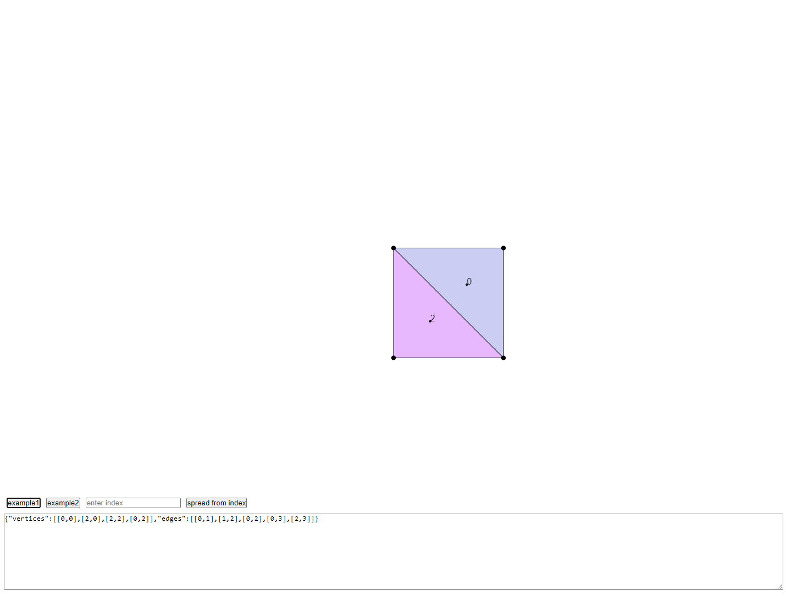

# polygon-finder
Quick exercise to find closed areas bound by a set of lines.

Assumptions:
- The collection is known to form closed polygons. No floating lines.
- Edges intersect only at defined points. No line-line intersections, make sure to split lines at such points and add the point in the vertices list.
- The whole data forms an interconnected component, no holes!

## Running the repo
The repo uses vite to build the example folder. Just run `npm i` followed by `npm run dev`

## API
### createHalfEdgeStore
Main function to help creating a half-edge structure and providing relvant APIs to query an navigate it.

## Example
The example exposes an input area at the bottom to input JSON data defining a list of edges and vertices.
One can add new examples there, or export new ones following the structure under `./exampleData'. 
A button will be created for each example file exported from there.

Clicking one of the `Example *` buttons showcases the process of parsing the input data, creating a half-edge data structure out of it, and using the necessary APIs to figure out all the cycles.

Once rendered, entering an index number in the `index input` showcases deserializing data from the previous step into a different instance of the half-edge data structure and visualizing the neighbors.

The last button `spread from index` will find and visualize neighborhoods at different depths from the chosen index.

